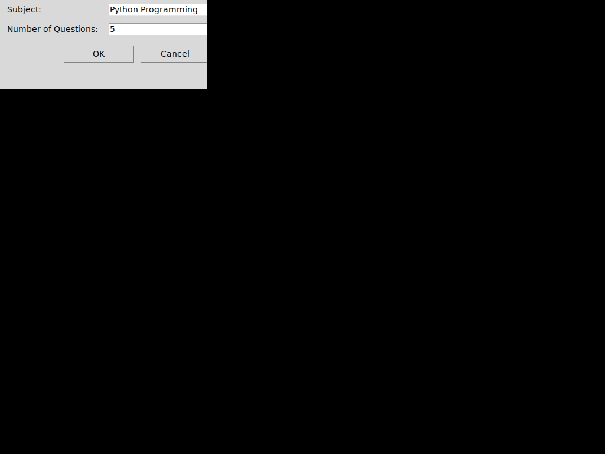
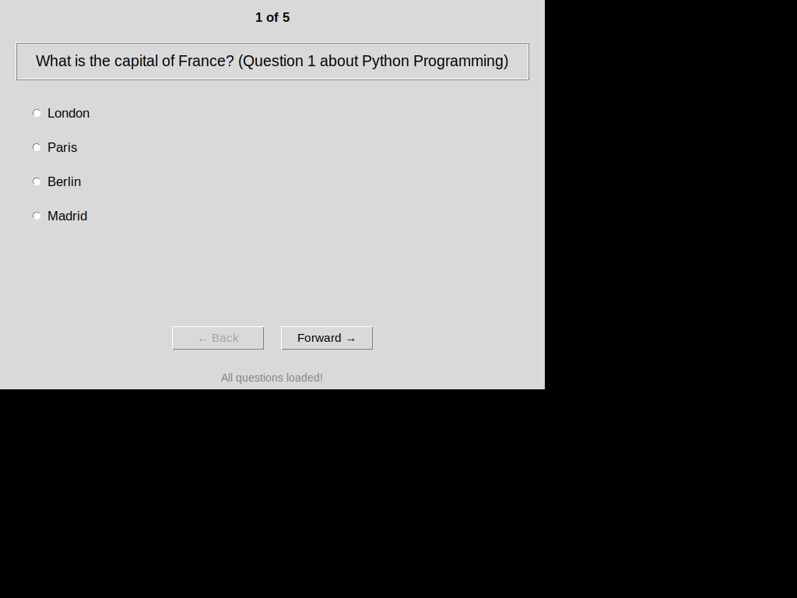
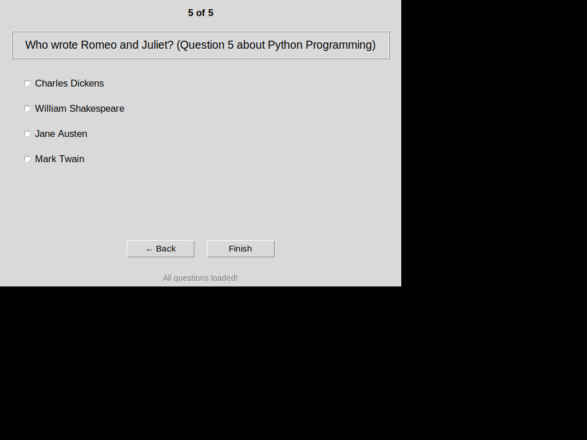

# Generative AI Quiz Application

A quiz application with a graphical user interface (GUI) that uses Python with Generative AI to 
automatically fetch and present random quiz questions with 
multiple choice answers for any subject.

## Installation

### Prerequisites

1. **Python 3.8 or higher**

2. **tkinter** (required for GUI)
   - **Linux/Ubuntu**: `sudo apt-get install python3-tk`
   - **macOS**: Comes with Python installation
   - **Windows**: Comes with Python installation

3. **Gemini API Key**
   - Get your API key from [Google AI Studio](https://aistudio.google.com/app/apikey)
   - Create a `.env` file in the project directory:
     ```
     GEMINI_API_KEY=your_api_key_here
     ```

### Install Python Dependencies

```bash
pip install -r requirements.txt
```

### Run the Application

```bash
python main.py
```

## Overview

This application features a tkinter-based GUI with:
- Initial dialog to enter quiz subject and number of questions
- Question panel displaying one question at a time
- Multiple choice answer selection with radio buttons
- Question counter showing progress (e.g., "1 of 25")
- Back and Forward navigation buttons
- Final score displayed as a percentage (0%-100%)

### GUI Screenshots

#### Initial Dialog



#### Main Quiz Window



#### Answer Selection


#### Last Question with Finish Button



#### Score Display


### CLI Version (Legacy)

The original CLI version screenshots are preserved below:

#### Starting a New Quiz (CLI)


#### Completion of Quiz (CLI)


