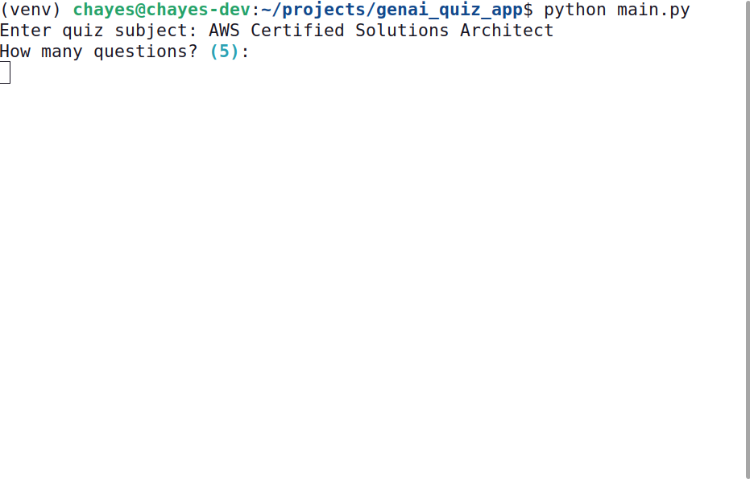
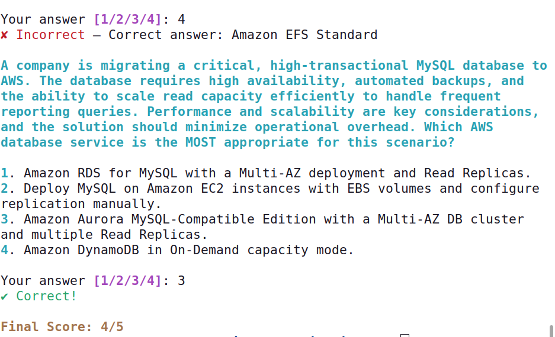

# Generative AI Quiz Application

A CLI quiz application that uses Python with Generative AI to 
automatically fetch and present random quiz questions with 
multiple choice answers for any subject.

## Overview

### Screen Examples

**Starting a New Quiz**

**Completion of Quiz**

